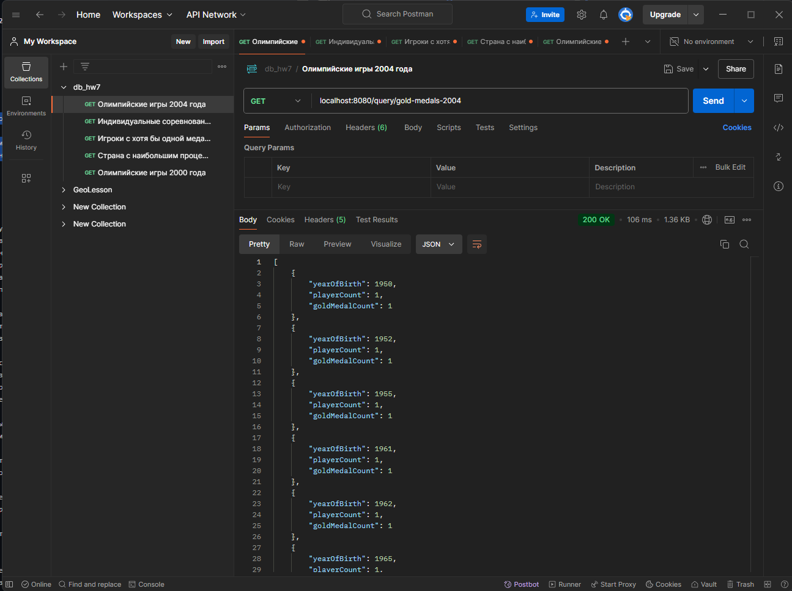
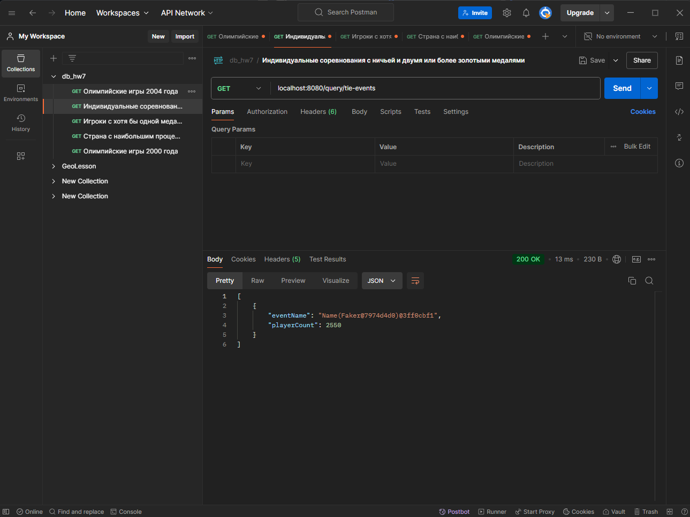
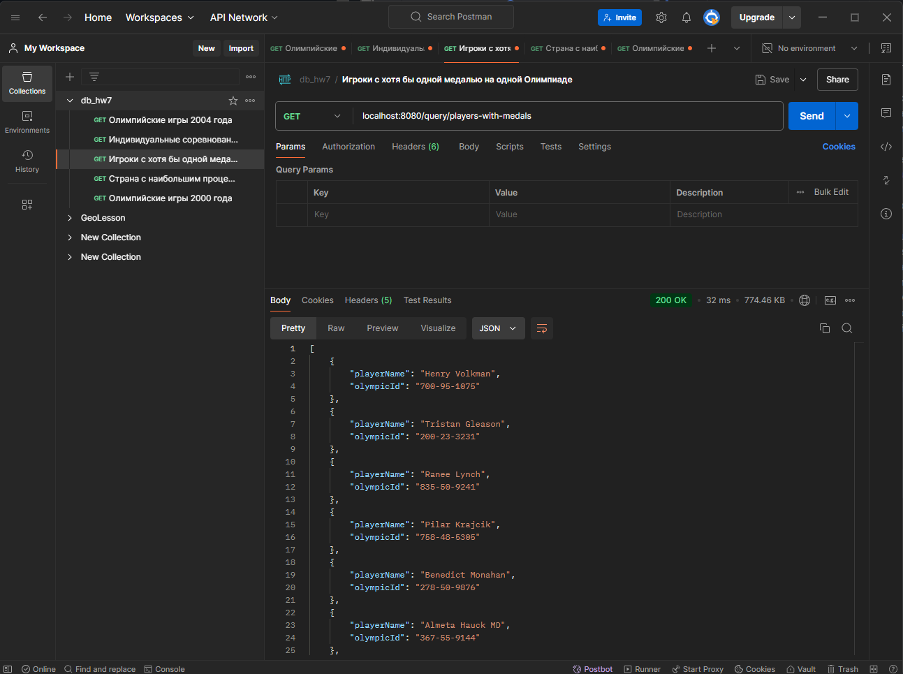
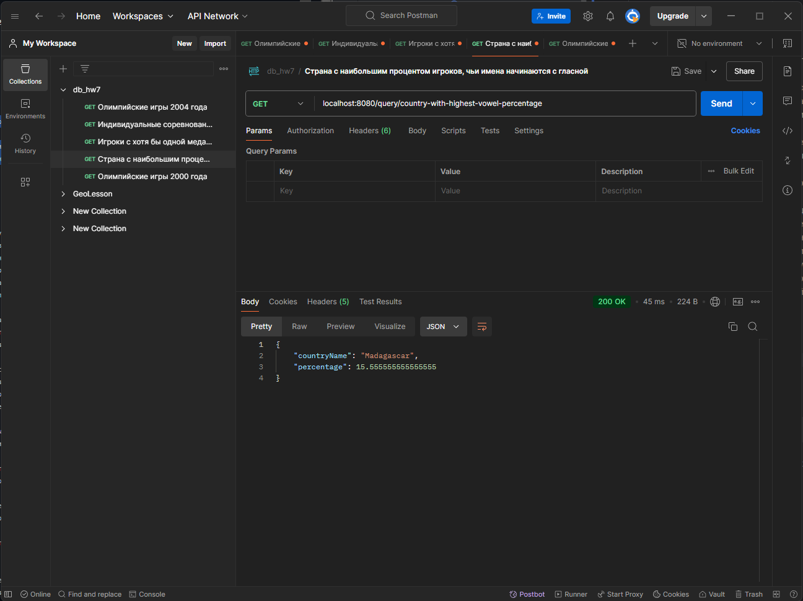
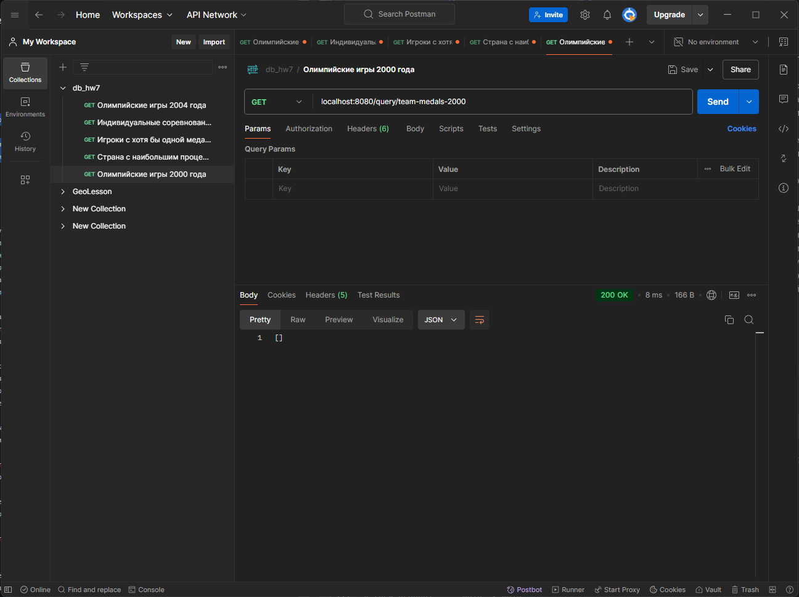

# Евсюков Александр БПИ224
## ДЗ 7. Базы данных

### Набор требований к проекту:
* `Java` версии 21
* `Gradle` версии 8.2?
* `Spring Boot` версии 3.3.5

### Инструкция по запуску:
1. Склонируйте репозиторий с помощью команды `git clone
2. Откройте проект в `IntelliJ IDEA`
3. Запустите БД с помощью команды `docker-compose up -d` в папке `dev-env` 
4. Запустите проект с помощью комбинации клавиш `Ctrl + F10` или нажав на кнопку `Run` в правом верхнем углу
5. Перейдите на сайт `http://localhost:8080/` и пользуйтесь (Рекомендую Postman)

### Запросы к API:
* Олимпийские игры 2004 года: `localhost:8080/query/gold-medals-2004`
* Индивидуальные соревнования с ничьей и двумя или более золотыми медалями: `localhost:8080/query/tie-events`
* Игроки с хотя бы одной медалью на одной Олимпиаде: `localhost:8080/query/players-with-medals`
* Страна с наибольшим процентом игроков, чьи имена начинаются с гласной: `localhost:8080/query/country-with-highest-vowel-percentage`
* Олимпийские игры 2000 года: `localhost:8080/query/team-medals-2000`

### Используемые библиотеки:
* `Spring Boot` - для создания RESTful API
* `Spring Data JPA` - для работы с базой данных
* `Postgres` - для хранения данных

### Описание дата сета
У спортсмена есть олимпийское удостоверение, имя, пол, страна и дата рождения.
У каждой олимпиады есть год, сезон (летний или зимний), страна, где она проходила, и город.
Каждый спортсмен в базе данных участвует по крайней мере в одной олимпиаде. Спортсмен может участвовать в нескольких соревнованиях на одной Олимпиаде и фактически может участвовать более чем в одной Олимпиаде. Например, Майкл Армстронг участвовал в соревнованиях по плаванию, дайвингу и водному поло. Ян Торп участвовал в летних Олимпийских играх 2000 года в Сиднее и завоевал 3 золотые и 2 серебряные медали. В Афинах 2004 года он завоевал две золотые, одну серебряную и одну бронзовую медали.
У события есть название вида спорта, название события, место проведения, а также запланированное время и дата, какие спортсмены должны были участвовать в соревнованиях, в каких соревнованиях и как они разместились, и кто был победителем (победителями) события (например, какой медалью они были награждены). Вы можете предположить, что нулевые значения используются для победителей и мест размещения до тех пор, пока событие не будет проведено.
Соревнования на Олимпийских играх могут быть как индивидуальными, так и командными. Если это командное мероприятие, мы хотим знать, кто был членом каждой команды. 

Задание выполняется с использованием любого языка/фреймворка. Рекомендуется Java/Python/PHP
наиболее удобные, понятные и простые ORM.
Требуется сделать:
Создать миграции, согласно схемы по ссылке выше
Создать скрипт для автоматического наполнения базы данных (seeder). Если не нашли готовой библиотеки, можно написать свой класс, который будет использовать любую библиотеку/сервис faker. В метод передаете сколько в качестве параметра количество записей которые нужно создать в БД. На выходе получаем БД с фейковыми заполненными данными.
Выполнить следующие задания с помощью ORM:
* Для Олимпийских игр 2004 года сгенерируйте список (год рождения, количество игроков, количество золотых медалей), содержащий годы, в которые родились игроки, количество игроков, родившихся в каждый из этих лет, которые выиграли по крайней мере одну золотую медаль, и количество золотых медалей, завоеванных игроками, родившимися в этом году.
* Перечислите все индивидуальные (не групповые) соревнования, в которых была ничья в счете, и два или более игрока выиграли золотую медаль.
* Найдите всех игроков, которые выиграли хотя бы одну медаль (GOLD, SILVER и
  BRONZE) на одной Олимпиаде. (player-name, olympic-id).
* В какой стране был наибольший процент игроков (из перечисленных в наборе данных), чьи имена начинались с гласной?
* Для Олимпийских игр 2000 года найдите 5 стран с минимальным соотношением количества групповых медалей к численности населения.

### Пример работы

